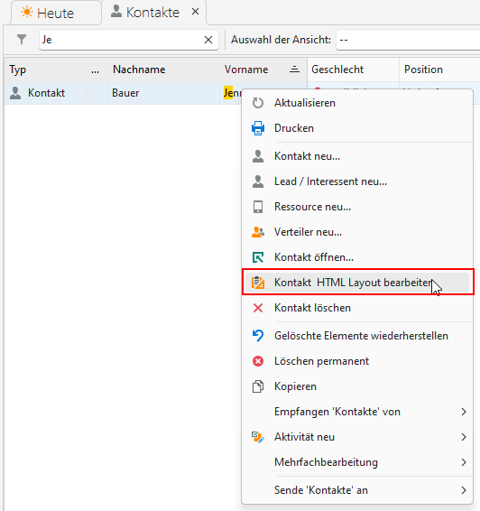

## Formular Anpassungen in HTML Code

Ab der CRM Version V8 steht der neue HTML Formular Designer zur Verfügung. Damit ist es möglich modern aussehende Eingabeformulare in HTML und CSS zu bearbeiten.

## Start des Formular Designers

Über das Kontext-Menü eines selektierten Elements (zum Beispiel Kontakt) kann der Menüpunkt **"Kontakt HTML Layout bearbeiten"** ausgewählt werden. Dieser startet den Formular Designer und aktiviert das Formular Layout des selektierten Elements (Kontaktes) für die weitere Bearbeitung.

## Bearbeitung des Formulars über die Bedienleiste

- **Liste**: erzeugt eine Liste bestehend aus Listenelementen, die auf- und zugeklappt werden können.
- **Listenelement**: erzeugt einen neuen Eintrag in der aktuell selektierten Liste bestehend aus der Vorschau und dem editierbaren Elemente im aufgeklappten Bereich.
- **HTML**: erzeugt ein HTML Element

## Bearbeitung des Formulars mit dem Layout Designer

Über die Bedienleiste steht der Button **"Layout bearbeiten"** zur Verfügung. Die vorher eingefügten Elemente können hier entsprechend platziert werden.

## Bearbeitung der HTML und CSS Quellen

Zum jeweils selektierten Listen oder HTML Element stehen folgende Bereiche zur Verfügung:

- **HTML**: enthält die HTML Tags zum Element
- **CSS**: enthält die Styles zum Element
- **CSS Global**: enthält die CSS Styles, die für alle Formulare und Elemente zur Verfügung stehen. ACHTUNG: eine Änderung dieses Inhalts ändert die Darstellung in allen Formularen.

## Einfügen eines Buttons zur Ausführung einer Funktion

Um im HTML Code einen Button für die Ausführung einer Funktion zu definieren muss das jeweilige HTML Tag mit dem ID der auszuführenden Funktion gekennzeichnet werden (hier *C_Btn_MyFunction*)

    

      
    

Im custom Code des entsprechenden Formulars muss die Funktion ***CreateHTMLFunctionNames*** überschrieben werden, um über die Methode *AddFunction* die Funktion anzumelden. Über den Funktions-Paramter wird die auszuführende Funktion angegeben.

    public override void CreateHTMLFunctionNames()
    {
      base.CreateHTMLFunctionNames();

      m_formDesignXML.AddFunction("C_Btn_MyFunction", "Beschreibung der Funktion", C_Btn_MyFunction);
    }

Diese Funktion wird beim Click auf das HTML Element aufgerufen. Der Parameter *strElementID* enthält dabei den ID des angeklickten Elements (hier *C_Btn_MyFunction*) und kann verwendet werden, um über die Funktion verschiedene Buttons zu behandeln.

    private bool C_Btn_MyFunction(string strElementId)
    {
      // auszuführender Code
    }

## Mehrsprachiger Text

Um einen statischen Text in den unterschiedlichen Sprachen darzustellen kann dieser mit dem **@** Zeichen beginnen. Damit wird er als Schlüsselwort erkannt und kann über das Modul **"Übersetzungstexte"** in die jeweilige Sprache übersetzt werden.

    
@C_MyText

Mit folgenden Einträgen im Modul **Übersetzungstexte** für Deutsch

> Sprache=de  
> Schlüssel=C_MyText  
> Text=Mein Text

und Englisch

> Sprache=en  
> Schlüssel=C_MyText  
> Text=My Text  
