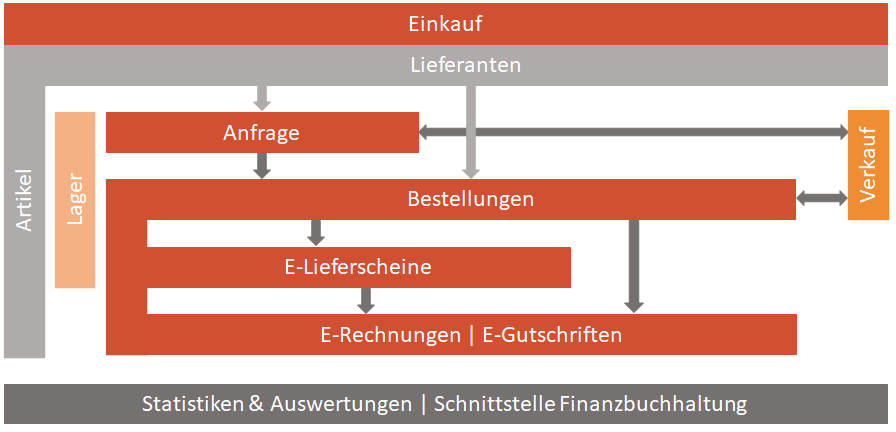

Im Bereich des Einkaufs werden Artikel bei Lieferanten angefragt und bestellt. Für das Lager werden Wareneingänge mittels eines Einkaufslieferschein gebucht. Zur Rechnungskontrolle kann man auch die E-Rechnungen zur jeweiligen Bestellung anlegen.

- **Anfrage**
Eine Anfrage dient zur Einholung von Informationen zu einer Ware (Preis, Lieferkonditionen) von einem oder mehreren Lieferanten. Man kann diese manuell erstellen oder von einem Verkaufs Angebot oder Auftrag überleiten.
- **Bestellung**
Die Bestellung ist die Basis der weiteren Belege, wie E-Lieferschein, E-Rechnung und E-Gutschrift für Lager, Menge, Rabatt und Preis. Eine Bestellung kann durch eine Anfrage übergeleitet oder manuell erstellt werden. Man kann diese auch direkt aus einem Verkaufs Angebot oder Auftrags Beleg überleiten.
- **E-Lieferscheine und E-Retourschein**
Ein E-Lieferschein dient zur Dokumentierung der gelieferten Ware (lagergeführte Artikel) oder auch Dienstleistung (nicht lagergeführte Artikel).
Ein E-Retourschein dokumentiert die zurückgelieferte Ware (lagergeführte Artikel).
- **E-Rechnungen und E-Gutschriften**
Eine E-Rechnung dokumentiert die gelieferte Ware oder auch Dienstleistung in der definierten Menge zum vereinbarten Preis.
Eine E-Gutschrift ist das Storno einer gesamten E-Rechnung oder nur ein Teil der Positionsmenge in einer E-Rechnung.
- **Belegs Überleitung aus Verkauf**
Die Belege Verkauf Angebot oder Auftrag kann man direkt überleiten in eine Einkaufs Anfrage oder Bestellung. Siehe Verkauf. [Siehe Verkauf](../Verkauf/index.md#).
- **Reporting/Schnittstellen**
Schon im Standard ist eine Vielzahl von Auswertungen und Statistiken zu den obengenannten Bereichen verfügbar. Individuelle Kundenwünsche können bei der Implementierung mitberücksichtigt werden.
