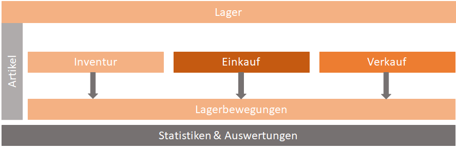

## Lager

Das Lager wird bei lagergeführten Artikeln durch die Einkaufs- und Verkaufslieferscheine geführt. Es können dabei mehrere Lager hinterlegt werden. Bei der Inventur kann der Lagerbestand mit dem tatsächlichen Bestand korrigiert werden. Ein detailierten Überblick gibt einem das Lagerbewegungs Modul. Hier sieht man alle Zu- und Abgänge zu einem Lager und Artikel.

- **Lager**\
Über die CRM Administration kann man über das Modul Lager eine beliebige Anzahl von Lagern pro Buchhaltungseinheit anlegen.
- **Artikel**\
Siehe Artikel <!-- ToDo Mike -->
- **Inventur**\
Bei der Inventur kann der Lagerbestand mit dem tatsächlichem Bestand korrigiert werden.
- **Einkauf**\
Im Bereich des Einkaufs werden Artikel bei Lieferanten angefragt und bestellt. Für das Lager werden Wareneingänge mittels Einkaufslieferschein gebucht. Durch einen Einkaufslieferschein wird eine Eingangs Lagerbewegung ausgelöst
- **Verkauf**\
Im Bereich des Verkaufs wird der gesamte Verkaufsprozess abgebildet. Dieser startet bei Verkaufschancen die es mit oder ohne verknüpfte Angebote geben kann. Aus gewonnenen Angeboten wird dann ein Auftrag erzeugt, der später mit oder ohne Lieferschein fakturiert wird.Durch einen Verkaufs Lieferschein wird eine Ausgangs Lagerbewegung ausgelöst. Über einen Retourschein wird eine Eingangs Lagerbewegung ausgelöst.
- **Lagerbewegungen**\
Lagerbewegungen finden ausschließlich durch Lieferscheine bzw. E-Lieferscheine statt. Der Lagerbestand kann mittels Inventur auf den tatsächlichen Bestand korrigiert werden, um damit einen möglichen Schwund zu berücksichtigen.
- **Reporting/Schnittstellen**\
Schon im Standard ist eine Vielzahl von Auswertungen und Statistiken zu den obengenannten Bereichen verfügbar. Individuelle Kundenwünsche können bei der Implementierung mitberücksichtigt werden.
