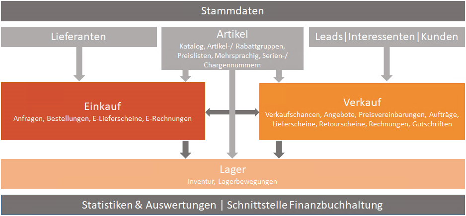

# Verkauf, Einkauf und Lager

## Stammdaten

In diesem Bereich finden Sie die Firmen- und Artikelstammdaten. Bei den Firmen unterscheiden wir je nach Firmentyp nach Lieferanten auf der Einkaufsseite und Interessenten und Kunden auf der Verkaufsseite.
Ganz wesentlich ist die strukturierte Erfassung der Artikelstammdaten, der die Basis für die Belegserfassung und Lagerhaltung ist. Über die Artikeleigenschaften definiert man zum Beispiel, ob ein Artikel lagergeführt wird, mit Serien bzw. Chargennummer und ob dieser verkauf- oder vermietbar ist. Weitere Artikeleigenschaften sind unter anderem auch die Mengeneinheit, Preiseinheit, Preislisten mit Einkaufs- und Verkaufspreis sowie die Zuordnung zu der jeweiligen Artikelgruppe, Rabattgruppe, Steuergruppe und die Artikelkatalog Verknüpfung.

## Einkauf

Im Bereich des Einkaufs werden Artikel bei Lieferanten angefragt und bestellt. Für das Lager werden Wareneingänge mittels eines Einkaufslieferschein gebucht. Zur Rechnungskontrolle kann man auch die E-Rechnungen zur jeweiligen Bestellung anlegen.

## Verkauf

Im Bereich des Verkaufs wird der gesamte Verkaufsprozess abgebildet. Dieser startet bei Verkaufschancen die es mit oder ohne verknüpfte Angebote geben kann. Aus gewonnenen Angeboten wird dann ein Auftrag erzeugt, der später mit oder ohne Lieferschein fakturiert wird. Im gesamten Ablauf sind wir sehr flexibel, wo in einem Unternehmen der Verkaufsprozess beginnt und endet. Für Unternehmen mit einem langen Vertriebszyklus (Objekt Geschäfte, Bauprojekte,...) empfehlen wir das Verkaufschancen Modul im Kombination mit dem Angebots Modul einzusetzen. Für Unternehmen mit einem kurzen Vertriebzyklus (Ersatzteil Handel ...) ist das Angebots Modul ausreichend.Für Unternehmen die keine eigene Warenwirtschaft oder ERP Lösung haben, sind in unserer SALES Professional oder SALES Enterprise Lizenzen eine sehr gute Alternative. [Siehe Details zu SALES Lizenzen unterhalb](#f%C3%BCr-verkauf-einkauf-und-lager-gibt-es-verschiedene-sales-lizenzen).

## Lager

Das Lager wird bei lagergeführten Artikeln durch die Einkaufs- und Verkaufslieferscheine geführt. Es können dabei mehrere Lager hinterlegt werden. Bei der Inventur kann der Lagerbestand mit dem tatsächlichen Bestand korrigiert werden. Ein detailierten Überblick gibt einem das Lagerbewegungs Modul. Hier sieht man alle Zu- und Abgänge zu einem Lager und Artikel.

## Vertriebsziele und Dashboard

Über Vertriebsziele kann eine Planung (Soll) für die Vertriebsmitarbeiter vorgenommen werden. Diese Planungsdaten (Soll) können im Dashboard den derzeitigen Ist Daten gegenübergestellt werden.

## Reporting/Schnittstellen

Im Standard werden schon eine Vielzahl von Auswertungen und Statistiken zu den obengenannten Bereichen angeboten. Individuelle Kundenwünsche können bei der Implementierung mitberücksichtigt werden. Daten können in beliebiger Form nach Excel oder auch ins Finanzbuchhaltungssystem übergeben werden. 

## Für Verkauf, Einkauf und Lager gibt es verschiedene SALES Lizenzen

- **SALES Basic Lizenz**
  - Verkaufschancen- und Angebots-Management
  - Vertriebsjahresplanung
  - Angebotsnachverfolgung mit Phasen und Gewichtung
  - Artikelgruppen und Artikelliste hierarchisch und mehrsprachig
  - Preislisten in verschiedenen Währungen
  - Rabattgruppenverwaltung
  - Umsätze aus Fremdsystem
  - Statistische Auswertungen

- **SALES Professional Lizenz**
  - Verkaufschancen- und Angebots-Management
  - Vertriebsjahresplanung
  - Angebotsnachverfolgung mit Phasen und Gewichtung
  - Artikelgruppen und Artikelliste hierarchisch und mehrsprachig
  - Preislisten in verschiedenen Währungen
  - Rabattgruppenverwaltung
  - Verkauf (Angebot, Auftrag, Lieferschein, Rechnung, Gutschrift)
  - Einkauf (Anfragen, Bestellungen, E-Lieferschein, E-Rechnung, Gutschrift)
  - FIBU Schnittstellen (RZL, BMD, DATEV,...)
  - Ermittlung der Cross-/Upselling-Potentiale

- **SALES Enterprise Lizenz**
  - Verkaufschancen- und Angebots-Management
  - Vertriebsjahresplanung
  - Angebotsnachverfolgung mit Phasen und Gewichtung
  - Artikelgruppen und Artikelliste hierarchisch und mehrsprachig
  - Preislisten in verschiedenen Währungen
  - Rabattgruppenverwaltung
  - Verkauf (Angebot, Auftrag, Lieferschein, Rechnung, Gutschrift)
  - Einkauf (Anfragen, Bestellungen, E-Lieferschein, E-Rechnung, Gutschrift)
  - FIBU Schnittstellen (RZL, BMD, DATEV,...)
  - Ermittlung der Cross-/Upselling-Potentiale
  - Lager (Wareneingänge/-ausgänge intern/extern, Inventur, Mehrlagerfähigkeit, Deckungsbeitragsberechnung)
  - Datanorm-Schnittstelle
  - Seriennummernverwaltung
  - Statistische Auswertungen
