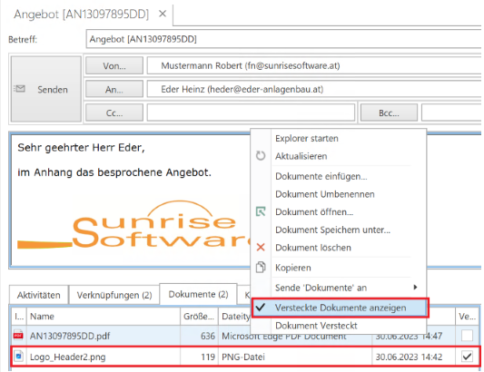

# Neuheiten

## Build 440

Journal Modul: Im E-Mail eingebettete Bilder werden nun nicht mehr als Anhang betrachtet, da in den letzten Jahren vermehrt Signaturen mit Bildern verwendet wurden.

## Build 439

Im Modulbaum sind die Postfächer wie in Outlook sortiert. So ist zum Beispiel der Posteingang jetzt der erste Eintrag.

Beim E-Mail Import wird über die E-Mail Adresse der Kontakt / die Firma gesucht. Dabei kann dieselbe E-Mail Adresse auch bei mehreren Kontakten/Firmen hinterlegt sein.
Jetzt werden alle gefundenen Kontakte/Firmen mit dem erzeugten Journal verknüpft - über einen Hinweis im Titel des Journals wird darauf hingewiesen.

## Build 438

In der Texteingabe (RichEdit) steht die "Format übertragen" Funktion zur Verfügung.
