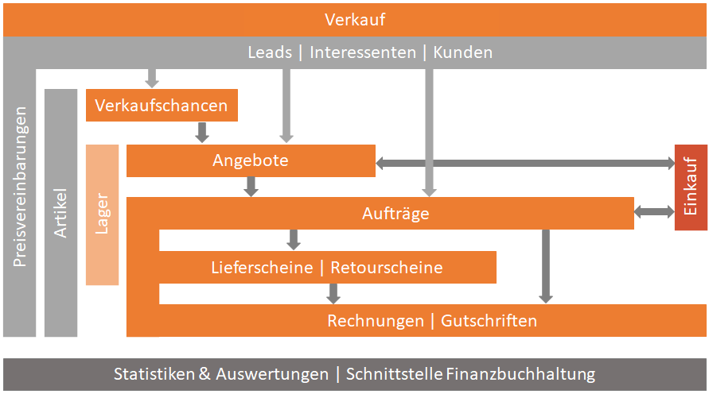

# Verkauf

Im Bereich des Verkaufs wird der gesamte Verkaufsprozess abgebildet. Dieser startet bei Verkaufschancen die es mit oder ohne verknüpfte Angebote geben kann. Aus gewonnenen Angeboten wird dann ein Auftrag erzeugt, der später mit oder ohne Lieferschein fakturiert wird. Im gesamten Ablauf sind wir sehr flexibel, wo in einem Unternehmen der Verkaufsprozess beginnt und endet. Für Unternehmen mit einem langen Vertriebszyklus (Objekt Geschäfte, Bauprojekte,...) empfehlen wir das Verkaufschancen Modul im Kombination mit dem Angebots Modul einzusetzen. Für Unternehmen mit einem kurzen Vertriebzyklus (Ersatzteil Handel ...) ist das Angebots Modul ausreichend.Für Unternehmen die keine eigene Warenwirtschaft oder ERP Lösung haben, sind in unserer SALES Professional oder SALES Enterprise Lizenzen eine sehr gute Alternative. Siehe Übersicht für Details zu SALES Lizenzen.  <!-- TODO ROBERT -->

- **Verkaufschance**
Die Verkaufschance ist die Klammer um den gesamten Verkaufsprozess - vom Erstkontakt bis zum Abschluss. Die VC kann angelegt werden, um das Budget des Kunden zu definieren. Ein VC Modul ist für Unternehmen empfehlenswert, wenn diese einen langen Vertriebszyklus haben (mehr als 5 Monate bis zum Verkaufsabschluss).

- **Angebote**
Ein Angebot ist die Reaktion auf eine Anfrage eines potentiellen oder vorhanden Kunden. In einem Angebot können Einleitung- und Abschlusstexte mit beliebigen Artikel und Freitext Artikel als Position hinterlegt werden. Die Summe dieser Positionen fließt, inkl. Deckungsbeitrag, in die Angebots Bewertung mit ein.

- **Aufträge**
Ein Auftrag gilt im CRM als eine Bestellung eines Kunden. Dieses kann ein angenommenes Angebot sein oder eine Bestellung ohne Angebot. Der Auftrag ist die Basis der weiteren Belege, wie Lieferschein, Rechnung und Gutschrift für Lager, Menge, Rabatt und Preis.

- **Lieferscheine und Retourscheine**
Ein Lieferschein ist ein Dokument für meine Kunden, damit die ausgelieferte Ware (lagergeführte Artikel) oder auch Dienstleistung (nicht lagergeführte Artikel) dokumentiert ist. Ein Retourschein wird für die Dokumentation der rückgelieferten Ware (lagergeführte Artikel) meiner Kunden verwendet. Mit der SALES Enterprise Lizenz wird auch eine Lagerführung pro Artikel und Lager ermöglicht. Durch einen Verkaufs Lieferschein wird eine Ausgangs Lagerbewegung ausgelöst. Über einen Retourschein wird eine Eingangs Lagerbewegung ausgelöst. Siehe Lager.  <!-- TODO ROBERT -->

- **Rechnungen und Gutschriften**
In der Rechnung ist die ausgelieferte Ware oder auch Dienstleistung für den Kunden in der definierten Menge zum vereinbarten Preis enthalten und das in Form eines Dokuments. Eine Gutschrift ist das Storno einer gesamten Rechnung oder nur ein Teil der Positionsmenge in einer Rechnung.

- **Preisvereinbarungen**
Das ist ein Beleg wo man pro Kunde Preise und Rabatte auf Artikelbasis hinterlegen kann mit einem gültig bis Datum. Eine Art Konditionsvertrag für einen Artikel zu Kunden. Die Preisvereinbarung wird bei allen Verkaufsbelegen (Verkaufschance, Angebot, Auftrag und Rechnung) für Rabatte und Preissuche pro Artikel herangezogen.

- **Schnittstellen Finanzbuchhaltung (FIBU) (RZL, BMD, DATEV,...)**
Für die Module Rechnungen, Gutschriften und Kunden (Debitoren) gibt es die Möglichkeit für einen FIBU Export für verschiedene Buchhaltungssysteme wie RZL, BMD oder DATEV. Sollte Ihr Buchhaltungssysteme fehlen können wir dieses per Customizing hinzufügen. Siehe Export FIBU.  <!-- TODO ROBERT -->

- **Einkauf**
Die Belege Angebot und Auftrag kann man direkt überleiten in eine Einkaufs Anfrage oder Bestellung. Siehe Einkauf. <!-- TODO ROBERT -->

- **Reporting/Schnittstellen**
Schon im Standard ist eine Vielzahl von Auswertungen und Statistiken zu den obengenannten Bereichen verfügbar. Individuelle Kundenwünsche können bei der Implementierung mitberücksichtigt werden. Daten können in beliebiger Form nach Excel oder auch über den FIBU Export an Finanzbuchhaltungssysteme übergeben werden.
