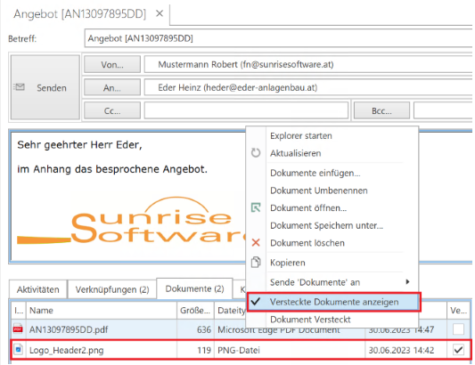

# Neuigkeiten

## Build 440

Journal Modul: Im E-Mail eingebettete Bilder werden nun nicht mehr als Anhang betrachtet, da in den letzten Jahren vermehrt Signaturen mit Bildern verwendet wurden.

## Build 439

Im Modulbaum sind die Postfächer wie in Outlook sortiert. So ist zum Beispiel der Posteingang jetzt der erste Eint....
